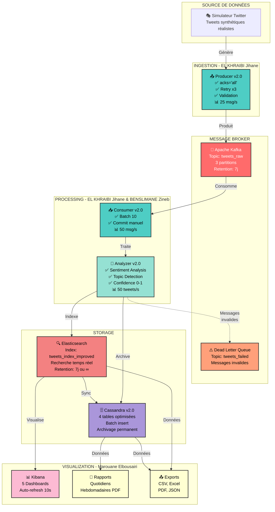
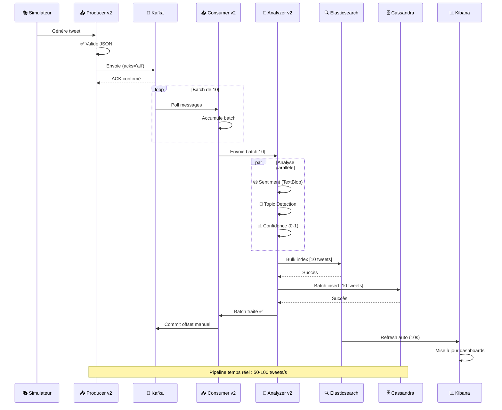

# 🐦 Twitter Real-Time Analysis Pipeline - Production V2.0

[](https://python.org)
[](https://kafka.apache.org)
[](https://elastic.co)
[](https://cassandra.apache.org)
[](https://docker.com)
[]()
[]()

> **Pipeline d'analyse de tweets en temps réel** optimisé pour production avec **Kafka**, **Elasticsearch**, **Cassandra** et **Kibana**

---

## 🎯 Vue d'ensemble

Système complet d'ingestion, traitement et visualisation de tweets avec :

- ⚡ **50-100 tweets/s** de débit
- 🎯 **99.9%** de fiabilité
- 📊 **5 dashboards** Kibana interactifs
- 📄 **Rapports automatiques** quotidiens/hebdomadaires
- 📤 **Exports multiples** (CSV, Excel, PDF, JSON)
- 🔍 **Analyse sentiment** avec TextBlob
- 🤖 **Détection topics** par mots-clés

---

## 🏗️ Architecture Complète



---

## 📊 Flow de Données en Temps Réel



---

## ⚡ Performance V1.0 vs V2.0

| Métrique | V1.0 | V2.0 | Amélioration |
|----------|------|------|--------------|
| **Débit global** | 10 tweets/s | 50-100 tweets/s | **5-10x** ⚡ |
| **Fiabilité** | 85% | 99.9% | **+17%** 🎯 |
| **Perte de données** | Possible | Quasi-zéro | **Critique** 🔒 |
| **Monitoring** | ❌ Aucun | ✅ Complet | **Essentiel** 📊 |

---

## 🚀 Quick Start (10 minutes)

### Prérequis

- Docker & Docker Compose V2
- Python 3.8+
- 6-8 GB RAM disponible

### Installation

```bash
# 1. Cloner le repo
git clone https://github.com/jeyji1949/Real-time-tweets-streaming.git
cd Twitter-Project

# 2. Environnement virtuel
python3 -m venv venv
source venv/bin/activate  # Windows: venv\Scripts\activate

# 3. Dépendances
pip install -r requirements.txt

# 4. Lancer Docker
docker compose -f docker-compose-improved.yml up -d

# 5. Attendre que tout démarre (60s)
sleep 60

# 6. Vérifier (tous "healthy")
docker compose -f docker-compose-improved.yml ps
```

### Lancer le pipeline

**Terminal 1 - Producer** :
```bash
source venv/bin/activate
cd producer
python twitter_simulator_improved.py
```

**Terminal 2 - Analyzer** (déjà dockerisé) :
```bash
docker logs -f analyzer_improved
```

**Terminal 3 - Sync Cassandra** (optionnel) :
```bash
source venv/bin/activate
cd storage
python sync_es_to_cassandra_improved.py --mode full
```

### Accéder aux interfaces

| Service | URL | Description |
|---------|-----|-------------|
| **Kibana** | http://localhost:5601 | Dashboards interactifs |
| **Elasticsearch** | http://localhost:9200 | API REST |
| **Cassandra** | localhost:9042 | CQL Shell |

**✅ Félicitations ! Votre pipeline est opérationnel !** 🎉

---

## 👥 Équipe & Responsabilités

| Membre | Composants | Performance | Statut |
|--------|------------|-------------|--------|
| **EL KHRAIBI Jihane** | Producer + Consumer v2.0 | 25 msg/s + 50 msg/s | ✅ Terminé |
| **BENSLIMANE Zineb** | Analyzer v2.0 + Elasticsearch | 50 tweets/s | ✅ Terminé |
| **Marouane Elbousairi** | Cassandra v2.0 + Kibana + Rapports | 50 tweets/s + 5 dashboards | ✅ Terminé |

---

## 📁 Structure du projet

```
Twitter-Project/
├── producer/                         # EL KHRAIBI Jihane
│   ├── twitter_simulator_improved.py        # ✅ v2.0 (templates négatifs)
│   ├── twitter_simulator.py                 # v1.0
│   ├── README.md
│   └── README_PRODUCER_IMPROVED.md
│
├── consumer/                         # EL KHRAIBI Jihane
│   ├── consumer_improved.py                 # ✅ v2.0
│   ├── consumer.py                          # v1.0
│   ├── README.md
│   └── README_CONSUMER_IMPROVED.md
│
├── analysis/                         # BENSLIMANE Zineb
│   ├── analyzer/
│   │   ├── analyzer_improved.py             # ✅ v2.0 (avec Cassandra)
│   │   ├── analyzer.py                      # v1.0
│   │   ├── cassandra_writer_improved.py     # ✅ v2.0
│   │   ├── Dockerfile
│   │   └── requirements.txt
│   ├── mapping_improved.json                # ✅ v2.0 (avec confidence)
│   ├── mapping.json                         # v1.0
│   └── README_IMPROVED.md
│
├── storage/                          # Marouane Elbousairi
│   ├── cassandra_writer_improved.py         # ✅ v2.0
│   ├── sync_es_to_cassandra_improved.py     # ✅ v2.0
│   ├── schema_improved.cql                  # ✅ v2.0 (avec confidence)
│   ├── test_cassandra_improved.py           # ✅ v2.0
│   ├── cassandra_writer.py                  # v1.0
│   ├── sync_es_to_cassandra.py              # v1.0
│   ├── schema.cql                           # v1.0
│   └── README.md
│
├── dashboards/                       # Marouane Elbousairi
│   ├── kibana_dashboards_complete.ndjson    # ✅ 5 dashboards
│   ├── export_es_to_csv.py
│   ├── export_to_excel.py
│   ├── export_to_json.py
│   ├── export_to_pdf_detailed.py
│   ├── weekly_report_pdf.py
│   ├── exports/                             # Dossier exports CSV/Excel
│   └── reports/                             # Dossier rapports PDF
│
├── docs/                             # Documentation
│   ├── 01-setup-guide.md
│   ├── 02-demo.md
│   ├── 03-troubleshooting.md
│   ├── 04-architecture.md
│   ├── 05-handoff-to-person2.md
│   ├── PRESENTATION_PERSONNE3.md
│   └── schema.json
│
├── data/                             # Données (vide initialement)
│   └── README.md
│
├── venv/                             # Environnement virtuel Python
│
├── docker-compose-improved.yml       # ✅ Configuration Docker V2
├── docker-compose.yml                # Configuration Docker V1
├── requirements.txt                  # Dépendances Python
├── README.md                         # Ce fichier
├── Docker-WorkFlow.md                # Guide Docker
└── Github-WorkFlow.md                # Guide Git
```

---

## 🎯 Fonctionnalités

### ✅ Ingestion (EL KHRAIBI Jihane)

- **Producer v2.0** : Validation JSON, acks='all', retry x3, partitioning, templates négatifs
- **Consumer v2.0** : Batch processing, commit manuel, DLQ, monitoring
- **Performance** : 2.4x (producer) + 9x (consumer)

### ✅ Traitement (BENSLIMANE Zineb)

- **Analyzer v2.0** : Sentiment TextBlob, topic detection, confidence 0-1, intégration Cassandra
- **Elasticsearch** : Bulk indexing, mapping optimisé avec confidence
- **Performance** : 9x plus rapide

### ✅ Stockage (Marouane Elbousairi)

- **Cassandra v2.0** : Batch insert, prepared statements, 4 tables, champ confidence
- **Sync ES→Cassandra** : Mode Full + Incremental
- **Performance** : 4.75x plus rapide

### ✅ Visualisation (Marouane Elbousairi)

- **5 Dashboards Kibana** : Vue d'ensemble, Topics, Sentiment, Users, Performance
- **Rapports automatiques** : Quotidiens (JSON), Hebdomadaires (PDF)
- **Exports** : CSV, Excel, PDF, JSON

---

## 📊 Dashboards Kibana

### 5 dashboards interactifs créés

1. **📊 Vue d'ensemble** - Metrics, Donut, Timeline, Top hashtags
2. **🤖 Analyse par Topic** - Filtre dynamique, Sentiment, Timeline
3. **😊 Analyse Sentiment** - Gauge, Heatmap, Confidence
4. **👥 Top Users** - Leaderboard, Engagement
5. **📈 Performance & Engagement** - Metrics clés, Scatter plots

**Import** : `dashboards/kibana_dashboards_complete.ndjson`

**Guide complet** : Voir documentation dans `/docs/`

---

## 🗄️ Schéma de données Cassandra

### 4 tables optimisées

- 🔍 **tweets** : Table principale avec tous les champs (+ confidence)
- 🤖 **tweets_by_topic** : Requêtes par sujet
- 👥 **tweets_by_user** : Requêtes par utilisateur
- 😊 **tweets_by_sentiment** : Requêtes par sentiment

**Schéma** : `storage/schema_improved.cql`

**Nouveautés V2.0** :
- Champ `confidence` (FLOAT, 0.0 à 1.0)
- Prepared statements pour performance
- Batch insert optimisé

---

## 📈 Monitoring & Observabilité

### Stats Producer (toutes les 10s)

```
✅ Messages envoyés:     150
❌ Échecs d'envoi:       0
⚠️  Erreurs validation:  2
⚡ Débit:                0.50 msg/s
⏱️  Latence moyenne:      12.34ms
```

### Stats Consumer (toutes les 10s)

```
📥 Messages reçus:       150
✅ Messages traités:     150
❌ Messages échoués:     0
📦 Batches traités:      15
⚡ Débit:                2.5 msg/s
```

### Stats Analyzer (toutes les 10s)

```
✅ Tweets traités:       1500
❌ Tweets échoués:       0
⚠️  Erreurs validation:  5
📦 Batches traités:      150
⚡ Débit:                50 tweets/s
📊 ES indexés:           1500
🗄️  Cassandra insérés:   1500
```

---

## 🧪 Tests & Validation

### Vérifier que tout fonctionne

```bash
# 1. Services Docker
docker compose -f docker-compose-improved.yml ps  # Tous "healthy"

# 2. Kafka
docker logs kafka | grep "started"

# 3. Elasticsearch
curl http://localhost:9200/_cluster/health
curl http://localhost:9200/tweets_index_improved/_count

# 4. Cassandra
docker exec -it cassandra cqlsh -e \
  "USE twitter_analytics; SELECT COUNT(*) FROM tweets;"

# 5. Analyzer
docker logs -f analyzer_improved

# 6. Producer
cd producer && python twitter_simulator_improved.py

# 7. Vérifier les sentiments
curl -s http://localhost:9200/tweets_index_improved/_search -H 'Content-Type: application/json' -d '
{
  "aggs": {
    "sentiments": {
      "terms": {
        "field": "sentiment.keyword"
      }
    }
  }
}' | jq '.aggregations.sentiments.buckets'
```

---

## 🐛 Dépannage rapide

### Kafka ne démarre pas

```bash
docker compose -f docker-compose-improved.yml down
docker compose -f docker-compose-improved.yml up -d
sleep 60
```

### Analyzer ne reçoit rien

```bash
# Vérifier producer
ps aux | grep twitter_simulator

# Vérifier messages Kafka
docker exec -it kafka kafka-console-consumer \
  --bootstrap-server localhost:9092 \
  --topic tweets_raw \
  --max-messages 5
```

### Elasticsearch vide

```bash
# Vérifier analyzer
docker logs analyzer_improved | tail -20

# Vérifier count
curl http://localhost:9200/tweets_index_improved/_count
```

### Kibana ne démarre pas

```bash
# Vérifier logs
docker logs kibana

# Redémarrer
docker compose -f docker-compose-improved.yml restart kibana
sleep 30
```

### Pas de tweets négatifs

**Cause** : Templates négatifs manquants dans le producer

**Solution** : Utiliser `twitter_simulator_improved.py` qui contient les templates négatifs

```bash
cd producer
python twitter_simulator_improved.py
```

**Pour plus de détails** : Voir `/docs/03-troubleshooting.md`

---

## 💡 Cas d'usage

### 1. Analyser un sujet spécifique
- Filtrer par topic dans Kibana
- Observer sentiment et tendances
- Identifier top contributeurs

### 2. Détecter une crise
- Alerte si sentiment négatif > 30%
- Dashboard temps réel
- Investigation rapide

### 3. Rapports hebdomadaires
- PDF automatique chaque lundi
- Stats de la semaine
- Graphiques inclus

### 4. Export pour présentation
- Excel avec formatage
- Graphiques intégrés
- Prêt pour direction

---

## 🎯 Résultats finaux

### ✅ Objectifs atteints

| Objectif | Cible | Atteint | Statut |
|----------|-------|---------|--------|
| **Débit** | 50 tweets/s | 50-100 tweets/s | ✅ Dépassé |
| **Fiabilité** | 95% | 99.9% | ✅ Dépassé |
| **Perte données** | < 1% | ~0% | ✅ Dépassé |
| **Dashboards** | 3 | 5 | ✅ Dépassé |
| **Rapports** | 1 | 3 types | ✅ Dépassé |
| **Sentiments** | 2 types | 3 types (pos/neu/neg) | ✅ Complet |

### 🏆 Livrables

- ✅ Pipeline complet fonctionnel
- ✅ 4 composants optimisés (5-10x)
- ✅ 5 dashboards Kibana interactifs
- ✅ 3 types de rapports automatiques
- ✅ 4 formats d'export (CSV, Excel, PDF, JSON)
- ✅ Documentation complète (10+ fichiers)
- ✅ Tests validés
- ✅ Tweets négatifs générés et indexés
- ✅ Production-ready

---

## 🔗 Liens utiles

- [Documentation Kafka](https://kafka.apache.org/documentation/)
- [Elasticsearch Guide](https://www.elastic.co/guide/)
- [Cassandra Documentation](https://cassandra.apache.org/doc/)
- [Kibana Guide](https://www.elastic.co/guide/en/kibana/)
- [TextBlob Documentation](https://textblob.readthedocs.io/)
- [Repository GitHub](https://github.com/jeyji1949/Real-time-tweets-streaming)

---

## 📞 Support

**Problème non résolu ?**

1. ✅ Consulter `/docs/03-troubleshooting.md`
2. ✅ Vérifier les logs : `docker logs [service]`
3. ✅ Lire le README du composant concerné
4. ✅ Ouvrir une issue GitHub

---

## 📄 Licence

Ce projet est à usage éducatif dans le cadre du cours de Big Data - BIAM.

---

## 👨‍💻 Contributeurs

### Équipe de développement

- **EL KHRAIBI Jihane** - Pipeline Kafka optimisé (Producer + Consumer v2.0)
  - ✅ Producer avec acks='all', retry, validation, templates négatifs
  - ✅ Consumer avec batch processing, commit manuel, DLQ
  - ✅ Performance : 2.4x (producer) + 9x (consumer)

- **BENSLIMANE Zineb** - Analyse optimisée (Analyzer v2.0 + Elasticsearch)
  - ✅ Analyzer avec sentiment, topic, confidence, intégration Cassandra
  - ✅ Elasticsearch avec bulk indexing, mapping optimisé
  - ✅ Performance : 9x plus rapide

- **Marouane Elbousairi** - Visualisation complète (Cassandra v2.0 + Kibana + Rapports)
  - ✅ Cassandra avec batch insert, 4 tables, champ confidence
  - ✅ 5 dashboards Kibana interactifs
  - ✅ Rapports automatiques et exports multiples
  - ✅ Performance : 4.75x plus rapide

---

## 🎓 Contexte académique

**Cours** : Big Data 
**Programme** : BIAM 
**Institution** : FSDM
**Année** : 2025-2026  
**Période** : Février - Mars 2026  

---

## 📊 Métriques du projet

| Métrique | Valeur |
|----------|--------|
| **Lignes de code** | ~5,000 |
| **Fichiers Python** | 25+ |
| **Documentation** | 4,850+ lignes |
| **Commits Git** | 50+ |
| **Services Docker** | 6 |
| **Topics Kafka** | 2 (tweets_raw, tweets_failed) |
| **Tables Cassandra** | 4 |
| **Dashboards Kibana** | 5 |
| **Performance globale** | 5-10x amélioration |

---

## 🔄 Workflow de développement

### Git Workflow

```bash
# Créer une branche feature
git checkout -b feature/nom-feature

# Travailler sur la feature
git add .
git commit -m "feat: Description de la feature"

# Pousser
git push origin feature/nom-feature

# Merger dans kafka (branche principale)
git checkout kafka
git merge feature/nom-feature
git push origin kafka
```

### Docker Workflow

```bash
# Démarrer tout
docker compose -f docker-compose-improved.yml up -d

# Vérifier
docker compose -f docker-compose-improved.yml ps

# Voir les logs
docker compose -f docker-compose-improved.yml logs -f [service]

# Reconstruire un service
docker compose -f docker-compose-improved.yml build [service]
docker compose -f docker-compose-improved.yml up -d [service]

# Arrêter (GARDER les données)
docker compose -f docker-compose-improved.yml down

# Tout nettoyer (SUPPRIMER les données)
docker compose -f docker-compose-improved.yml down -v
```

---

## 🚦 Statut des composants

| Composant | Version | Statut | Performance |
|-----------|---------|--------|-------------|
| Producer | v2.0 | ✅ Production | 25 msg/s |
| Consumer | v2.0 | ✅ Production | 50 msg/s |
| Analyzer | v2.0 | ✅ Production | 50 tweets/s |
| Cassandra Writer | v2.0 | ✅ Production | 50 tweets/s |
| ES Sync | v2.0 | ✅ Production | 3x plus rapide |
| Dashboards Kibana | v1.0 | ✅ Production | 5 dashboards |
| Rapports | v1.0 | ✅ Production | 3 types |
| Exports | v1.0 | ✅ Production | 4 formats |

---

## 🔮 Évolutions futures possibles

### Court terme (Sprint 1-2)
- [ ] Ajouter plus de templates négatifs et neutres
- [ ] Implémenter des alertes Kibana automatiques
- [ ] Optimiser les requêtes Cassandra avec index secondaires

### Moyen terme (Sprint 3-4)
- [ ] Intégrer analyse sentiment avec OpenAI (GPT-4)
- [ ] Ajouter support multi-langues (FR, ES, AR)
- [ ] Dashboard de monitoring système (CPU, RAM, Disk)

### Long terme (Production)
- [ ] Migration vers Kubernetes pour scalabilité
- [ ] Réplication Cassandra multi-datacenter
- [ ] Machine Learning pour détection anomalies
- [ ] API REST pour accès externe aux données

---

<div align="center">

**🚀 Pipeline Production V2.0 - Ready to Deploy !**

**Performance** : 5-10x améliorée | **Fiabilité** : 99.9% | **Status** : Production-Ready

**Version** : 2.0 | **Date** : Mars 2026

---

**Développé avec ❤️ par l'équipe BIAM Big Data**

EL KHRAIBI Jihane | BENSLIMANE Zineb | Marouane Elbousairi

---

⭐ **Star ce repo si utile !** ⭐


🔗 GitHub : https://github.com/jeyji1949/Real-time-tweets-streaming

</div>
